# Atari ST RP2040/RP2350 IKBD Emulator

This project allows you to use a RP2040 or RP2350 microcontroller (Raspberry Pi Pico or Pico 2) to emulate the HD6301 controller that is used as the intelligent keyboard controller for the Atari ST/STe/TT series of computers. 
This is useful if for example you have a Mega ST that is missing its keyboard. The emulator provides the ability to use a USB keyboard, mouse and joysticks with the ST.

The original project was initially created by fieldofcows in 2020 https://github.com/fieldofcows/atari-st-rpikb. This project builds on this great foundation to improve compatability, stability and add support for many modern game controllers either Wired or Bluetooth connected.

The "ultramegausb" title is intended to highlight the massively enhanced USB compatability from the great work of TinyUSB project, Bluepad32 and associated projects listed below.

This project is opensource and I am happy to recieve PR's and issues to further improve capabilies.
Lookout for a published roadmap of new features and an easy to build hardware device you can self manufacture.


## USB Support
USB HID Keyboards

USB HID Mice

USB HID XY Mice - Inc Microsoft Trackballs

Mouse wheel scrolling mapped to GEM Desktop cursor controls (12.5.x)

Logitech Unifying Adapter - Keyboard, Mice, Trackball

Logitech Bolt Adapter - Keyboard, Mice, Trackball

## Bluetooth Support (Pico 2 W only)

The emulator supports Bluetooth keyboards, mice, and gamepads on the Raspberry Pi Pico 2 W (RP2350). This allows you to use wireless devices without USB cables, providing a completely wireless setup for your Atari ST.

### Supported Bluetooth Devices

- **Bluetooth Keyboards**: Standard HID keyboards with full shortcut support (Ctrl+F4, Ctrl+F11, etc.)
- **Bluetooth Mice**: Standard HID mice with scroll wheel support (scroll wheel mapped to cursor up/down keys)
- **Bluetooth Gamepads**: DualSense, DualShock 4, Switch Pro, Xbox Wireless, and more via [Bluepad32](https://github.com/ricardoquesada/bluepad32)

### Pairing Bluetooth Devices

Pairing is simple - **just put your device into Bluetooth pairing mode**. The emulator will automatically detect and connect to supported devices. The emulator continuously scans for new devices, so you can pair devices at any time without needing to restart.

### Bluetooth Mode Selection

On the splash screen (homescreen), you can use the **left button** to cycle between three modes:
- **USB + Bluetooth** (default): Both USB and Bluetooth devices are active simultaneously
- **USB only**: Only USB devices are used, Bluetooth is disabled
- **Bluetooth only**: Only Bluetooth devices are used, USB is disabled

### Resetting Bluetooth Pairings

If you need to clear stored Bluetooth pairing keys (for example, if a device won't reconnect or you want to re-pair from scratch), press the **right button** on the splash screen. This will delete all stored Bluetooth pairing information, allowing you to re-pair devices from scratch.

### Bluetooth Gamepad Support

Bluetooth gamepads work just like USB gamepads:
- They appear in the joystick count alongside USB controllers
- They can be assigned to Joystick 0 or Joystick 1 via the OLED interface
- **Llamatron dual-stick mode works with Bluetooth gamepads** (requires exactly one gamepad, USB or Bluetooth)
- All keyboard shortcuts work with Bluetooth keyboards (Ctrl+F4, Ctrl+F11, etc.)

**Note**: Bluetooth support requires a Pico 2 W (RP2350). The original Pico W (RP2040) does not have enough RAM for Bluetooth support.

## Game Controller support.

USB HID Joysticks

PlayStation 3 DualShock 3 Controllers

PlayStation 4 DualShock 4 Controllers

Xbox Xinput - Xbox One, Xbox 360 Controllers

Nintendo Switch Pro Controller (Version 1)

PowerA Fusion Wireless Arcade Stick for Nintendo Switch

Google Stadia Controller

Nintendo Switch / Wii U GameCube Controller USB Adapter (v11.0.0)


## Keyboard Shortcuts

The emulator supports several keyboard shortcuts for convenient control:

| Shortcut | Function | Description |
|----------|----------|-------------|
| **Ctrl+F12** | Toggle Mouse Mode | Switches between USB mouse and joystick 0 |
| **Ctrl+F11** | XRESET | Triggers HD6301 hardware reset (like power cycling the IKBD) |
| **Ctrl+F10** | Toggle Joystick 1 | Switches Joystick 1 between D-SUB and USB |
| **Ctrl+F9** | Toggle Joystick 0 | Switches Joystick 0 between D-SUB and USB |
| **Ctrl+F8** | Restore Joystick Mode | Sends 0x14 to restore joystick event reporting (useful after reconnect) |
| **Ctrl+F4** | Llamatron Dual-Stick Mode | Share a single dual-stick USB pad across Joystick 0 & 1 (requires exactly one USB pad, both ST ports set to USB) |
| **Alt+/** | INSERT Key | Sends Atari ST INSERT key (useful for sending mouse click on Logitech Mac USB keyboards) |
| **Alt+[** | Keypad /** | Sends Atari ST keypad divide key |
| **Alt+]** | Keypad *** | Sends Atari ST keypad multiply key |
| **Alt+Plus** | Set 270MHz | Overclocks RP2040 to 270MHz for maximum performance |
| **Alt+Minus** | Set 150MHz | Sets RP2040 to 150MHz for stability |
### IKBD Command Macros

For reference, these shortcut keys emit the following HD6301/IKBD command sequences:

| Shortcut | Command Sequence | Effect |
| --- | --- | --- |
| `Ctrl+F5` | `0x1A 0x00`, `0x92 0x00`, `0x08` | Disable joystick reporting, enable mouse, enter relative mode |
| `Ctrl+F6` | `0x1A 0x00`, `0x92 0x00`, `0x09 0x02 0x80 0x01 0x90` | Disable joystick, enable mouse, enter absolute mode (640×400) |
| `Ctrl+F7` | `0x1A 0x00`, `0x92 0x00`, `0x0A 0x01 0x01` | Disable joystick, enable mouse, set mouse keycode mode |
| `Ctrl+F8` | `0x14` | Restore joystick event reporting |
| `Ctrl+F11` | `XRESET` line | Full IKBD reset pulse |
| `Alt+/`, `[`, `]` | `0x52`, `0x65`, `0x66` | Insert / keypad divide / keypad multiply |

### Llamatron Dual-Stick Mode

`Ctrl+F4` enables “Llamatron” mode: if exactly one USB gamepad with two thumbsticks is connected (and both Atari joystick ports are set to USB), the left stick + face buttons continue to drive Joystick 1, the right stick transparently emulates Joystick 0 movement, and the east/right face button (Circle on PlayStation, B on Xbox, A on Switch, B on Stadia) becomes Joystick 0 fire. This is handy for twin-stick shooters like *Llamatron* that expect two physical joysticks. The mode automatically suspends itself if a second pad is attached or either ST port is switched back to the DB‑9 connector.


The emulator displays a simple user interface on an OLED display. This is entirely optional and you can build a working version without it but
it is certainly useful to show successful connection of your USB devices as well as to allow the mouse speed to be tweaked and to view the data
flowing between the emulator and the Atari ST.

The interface is now available in English, French, German, Spanish and Italian.

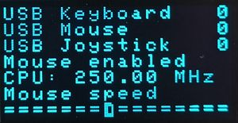 &emsp; 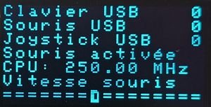 &emsp; 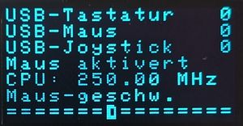

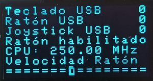 &emsp; 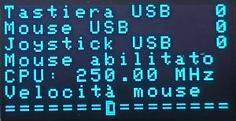

The emulator supports both USB and Atari ST compatible joysticks, supported a maximum of two joysticks at a time. Using the user interface
you can select whether the USB joystick or Atari joystick are assigned to Joysticks 0 and 1.

## How it works
The Atari ST keyboard contains an HD6301 microcontroller that can be programmed by the Atari TOS or by user applications to read the keyboard, mouse and joysticks. The keyboard is connected to the Atari via a serial interface. Commands can be sent from the Atari to the keyboard and the keyboard sends mouse movements, keystrokes and joystick states to the Atari.

Instead of writing code to handle the serial protocol between the Atari and the keyboard, this project provides a full emulation of the HD6301 microcontroller and the hardware connected to it. This means that it appears to the Atari as a real keyboard, and can be customised and programmed by software like a real keyboard, providing maximum compatibility.

The RP2040 USB host port is used to connect a keyboard, mouse and joysticks using a USB hub. These are translated into an emulation of the relevant device and fed into the emulated HD6301 control registers, allowing the HD6301 to determine how to communicate this with the Atari.

## Building the emulator
The emulator is configured as per the schematic below.

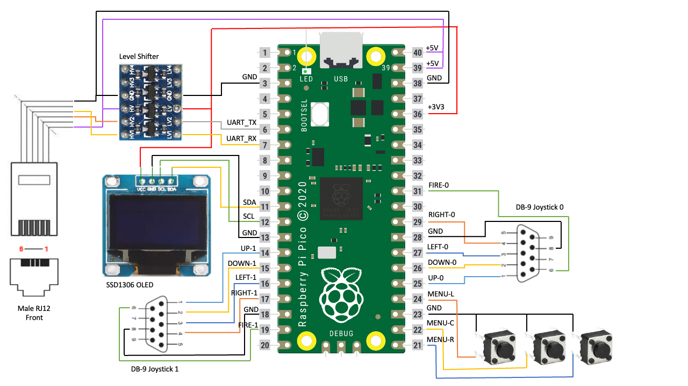

All of the external components except the level shifter are optional - you do not need to include the display and buttons if you are happy to hardcode mouse acceleration and joystick assignment settings in code. Also, if you only plan to use USB joysticks then you can omit the DB-9 connectors.

The level shifter is required as the Atari uses 5V logic over the serial connection whereas the Pico uses 3.3V logic. You can possible get away with leaving UART_RX disconnected and connect UART_TX to the Atari without a level shifter but many games and applications will not work like this as they send commands to the IKBD/emulator.

## Compiling the Emulator Firmware

To compile the firmware you will need to checkout this repository, sync the included submodules and make a small change to the pico-sdk CMakelist.txt.

### Quick Build (Both Pico and Pico 2)

### Mac (ARM)  

Compiling on the mac requires xcode, gcc and arm embedded toolchain. A build can be performed with the following commands:

```bash
# Production build (debug disabled)
./build-all.sh

# Debug build (enable controller debug screens)
DEBUG=1 ./build-all.sh

# French interface
LANGUAGE=FR ./build-all.sh

# Outputs: dist/atari_ikbd_pico.uf2 and dist/atari_ikbd_pico2.uf2
```

PC (Linux)
```
#Install GCC
sudo apt install gcc-arm-none-eabi

#Install cmake
sudo apt install cmake

#Clone the main repo in your home folder
git clone --recursive https://github.com/klyde2278/atari-st-rpikb.git

#Update submodules
cd atari-st-rpkib
git submodule update --init --recursive

#fix missing hidparser include in cmakelists.txt
Open file: atari-st-rpikb/pico-sdk/src/rp2_common/tinyusb/CMakeLists.txt
If not present, add this line after line 91:  ${PICO_TINYUSB_PATH}/src/class/hid/hidparser/HIDParser.c
You should have:

target_sources(tinyusb_host INTERFACE
            ${PICO_TINYUSB_PATH}/src/portable/raspberrypi/rp2040/hcd_rp2040.c
            ${PICO_TINYUSB_PATH}/src/portable/raspberrypi/rp2040/rp2040_usb.c
            ${PICO_TINYUSB_PATH}/src/host/usbh.c
            ${PICO_TINYUSB_PATH}/src/host/usbh_control.c
            ${PICO_TINYUSB_PATH}/src/host/hub.c
            ${PICO_TINYUSB_PATH}/src/class/cdc/cdc_host.c
            ${PICO_TINYUSB_PATH}/src/class/hid/hid_host.c
            ${PICO_TINYUSB_PATH}/src/class/hid/hidparser/HIDParser.c
            ${PICO_TINYUSB_PATH}/src/class/msc/msc_host.c
            ${PICO_TINYUSB_PATH}/src/class/vendor/vendor_host.c
            )
From your atari-st-rpikb folder:
mkdir build
cd build

# Choose one of the cmake command below according to the language and version number you want to display:
cmake -DLANGUAGE=EN .. # For English interface
or
cmake -DLANGUAGE=FR ..  # For French interface
or
cmake -DLANGUAGE=DE ..  # For German interface
or
cmake -DLANGUAGE=SP ..  # For Spanish interface
or
cmake -DLANGUAGE=IT ..  # For Italian interface

make
```

## Downloading the firmware
If you don't know how or can't build the firmware by yourself, please use the builds in the releases link.

## Using the emulator
If you build the emulator as per the schematic, the Pico is powered directly from the Atari 5V supply. The Pico boots immediately but USB enumeration can take a few seconds. Once this is complete, the emulator is fully operational.

The user interface has multiple pages that are rotated between by pressing the middle UI button. The first three pages all show the number of connected USB devices at the top but allow configuration of an option below. The pages in order are:

0. **Splash Screen** (ATARI logo): Shows firmware version and connection status. On Pico 2 W builds with Bluetooth support:
   - **Left button**: Cycles between USB+Bluetooth, USB only, and Bluetooth only modes
   - **Right button**: Deletes all stored Bluetooth pairing keys (useful for troubleshooting connection issues)

1. USB Status + Mouse speed. Left and right buttons change allow the mouse speed to be altered.
   
   

2. USB Status + Joystick 0 assignment. Left and right buttons toggle between USB joystick and DB-9 joystick.
   
   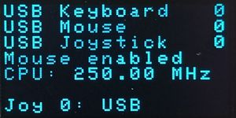 &emsp; 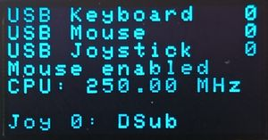

3. USB Status + Joystick 1 assignment. Left and right buttons toggle between USB joystick and DB-9 joystick.
   
   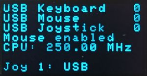 &emsp; 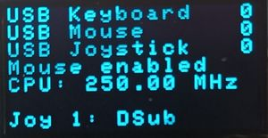

4. Serial data Tx/Rx between emulator and Atari (Debug builds Only). Data received from the Atari is on the left, data sent to the Atari is on the right.
   
   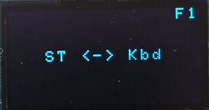

The serial data page should only be used for ensuring the connection works. Displaying the page slows down the emulator and you may seem some mouse lag whilst it is active.

The real ST keyboard has a single DB-9 socket which is shared between the mouse and Joystick 0. The emulator allows you to have a mouse and joystick plugged in simultaneously but you need to select whether the mouse or joystick 0 is active. This can be toggled by pressing the Scroll Lock button on the keyboard. The current mode is shown on any of the status pages on the OLED display.

## USB Controller Support

The emulator supports multiple types of USB game controllers with reliable hot-swapping:

- **Xbox Controllers**: Xbox 360 (wired/wireless), Xbox One, Xbox Series X|S, Original Xbox
- **PS3 DualShock 3**: Full support via USB (wired) (v10.0.0)
- **PS4 DualShock 4**: Full support via USB (wired)
- **Nintendo Switch Pro Controller**: Full support with analog stick precision and no drift
- **PowerA Fusion Wireless Arcade Stick**: Full support for Nintendo Switch arcade sticks (v8.0.0)
- **Google Stadia Controller**: Full support for Stadia controllers (v8.0.0)
- **Nintendo Switch / Wii U GameCube Adapter**: Full support for official Nintendo GameCube controller USB adapter (v11.0.0)
- **Generic HID Joysticks**: Standard USB joysticks and gamepads


## Fixes
The original fieldofcows build had to fix a number of TinyUSB bugs and contained a patched branch of the TinyUSB code. This project uses the latest mainline version of Tiny USB with customizations being externalized,

This build also fixes the following bugs in the original build:
* USB devices are detected more consistenly and faster due to using the newer TinyUSB library.
* The build uses mainline Pico SDK and TinyUSB Libraries
* The Emulator now supports USB devices that enumerate multiple endpoints such as Logitech unifying and bolt adapters.
* Optimizations to Timing for the Atari RX Serial Link lowering checks from 10ms to us - fixing dropped data - 0x14 Joystick mode commands now work consistently (Great news for Ikari Warriors fans).
* Reduced Core1 6301 emulator sleep from 1ms → 250μs (4x improvement)
* Added 6301 buffer reporting.
* Enabled UART FIFO for RX and TX (32X buffer)

irectly to the Pico and not plugged into another hub.

## Acknowledgements
This project is based on the amazing work of many people. Especially fieldofcows (https://github.com/fieldofcows/atari-st-rpikb) who created this project.
In turn the project was pieced together from code extracted from [Steem SSE](https://sourceforge.net/projects/steemsse/). All of the work of wiring up the keyboard functions to the HD6301 CPU is credited to Steem SSE. This project contains a stripped-down version of this interface, connecting it to the Raspberry Pi's serial port.

Steem itself uses the HD6301 emulator provided by sim68xx developed by Arne Riiber. The original website for this seems to have gone but an archive can be found [here](http://www.oocities.org/thetropics/harbor/8707/simulator/sim68xx/).

The code to handle the OLED display is Copyright (c) 2021 David Schramm and taken from https://github.com/daschr/pico-ssd1306.

Mult language support was added by Klyde https://github.com/klyde2278/atari-st-rpikb who also sells a nice kit and device to run this firmware on.

## Credits
To create this ultramegausb build I also relied on the following projects for inspiration and reference implementations:

- **[Bluepad32](https://github.com/ricardoquesada/bluepad32)** by Ricardo Quesada - Bluetooth HID gamepad library providing support for DualSense, DualShock 4, Switch Pro, Xbox Wireless, and other Bluetooth gamepads
- **[tusb_xinput](https://github.com/Ryzee119/tusb_xinput)** by Ryzee119 - TinyUSB XInput host driver used for Xbox controller support
- **[BetterJoy](https://github.com/Davidobot/BetterJoy)** by Davidobot - Reference implementation for Nintendo Switch Pro Controller USB initialization and protocol handling
- **[stadia-vigem](https://github.com/walkco/stadia-vigem)** by walkco - Complete USB HID report format and button mapping for Google Stadia Controller support
- **[wii-u-gc-adapter](https://github.com/ToadKing/wii-u-gc-adapter)** by ToadKing - Linux driver for Wii U GameCube adapter, reference for USB protocol and report format
- **[osx-wiiu-gcc-adapter](https://github.com/area/osx-wiiu-gcc-adapter)** by area - macOS userspace driver for GameCube adapter using async interrupts
